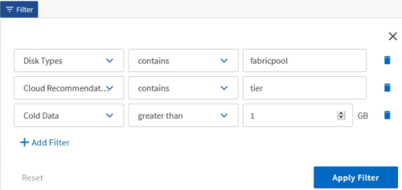

= Filtrado de datos
:allow-uri-read: 
:icons: font
:imagesdir: ../media/

[role="lead"]
Filtre los datos para asegurarse de que los resultados coinciden con los requisitos del informe. El filtrado le permite mostrar únicamente los datos que le interesen.

== Pasos

. Haga clic en el icono de filtro para agregar filtros para enfocar los resultados que desea ver y, a continuación, haga clic en *aplicar filtro*.
+

. Asigne un nombre a la vista sin guardar para guardar los cambios.

